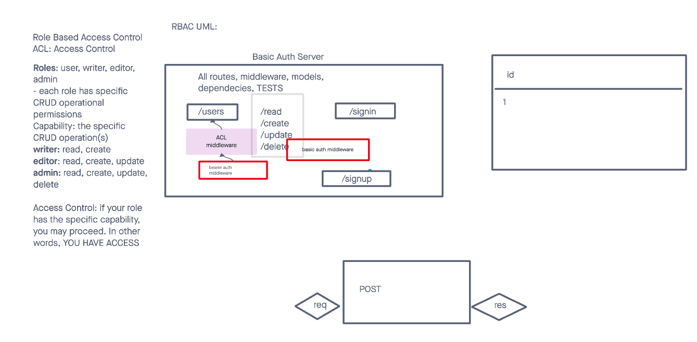

# LAB - Class 08

## Project: Auth API SERVER

### Author: Malik Sadiki-Torres

### Problem Domain

Implement authentication to the server
### Links and Resources

- [GitHub Actions ci/cd](https://github.com/MalikTorres/auth-api)
- [back-end server](https://bearer-auth-r674.onrender.com)

### Collaborators
I referenced Ryan Gallaways demo and implemented test with the help of AI

### Setup

Install required dependecies and create postgres database

#### `.env` requirements (where applicable)

port variable exists within the env sample

#### How to initialize/run your application (where applicable)

clone repo, `npm i`, then run `nodemon` in the terminal. Then set up your postgres database

#### Routes
 CRUD ROUTES: GET,POST,PUT,DELETE
- GET : `/users` - specific route to hit
- GET : `/food`
- GET : `/clothes`
- POST: `/signin`
- POST: `/signup`

#### Tests

to run tests, after running `npm i`, run the command `npm test`

#### UML

